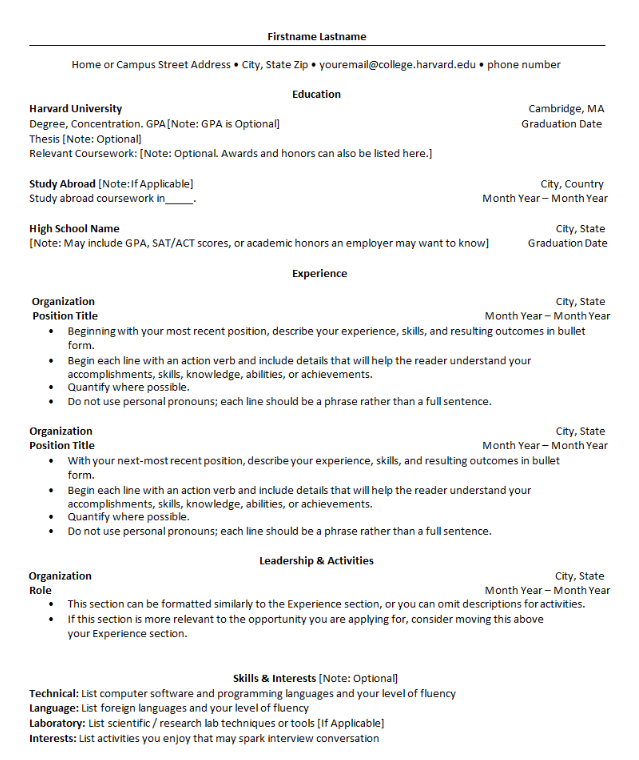

# Frontend Specification

Create a static website that serves an html resume.

## Resume Format

- Living in north america in Canada, resume format should exclude discrimitive information. For instance photo, genre.

- The  resume follows the format of [Harvard Resume Template](https://careerservices.fas.harvard.edu/resources/category/resume-cv-cover-letter-templates/)

### Resume Format 
[Current Resume](./docs/resume-format.docx)


## Coding

I Keep It Short and Simple since the purpose of this implemention is learning DevOps.

### HTML Structure
Implementation du bare minimun. 

### CSS Styling
As minimal as possible. This wil be improve in the Mod oriented for development.

### Local Static Website

To serve the website locally to ajust the CSS

#### Installation 

[Node http-server](https://www.npmjs.com/package/http-server)
```sh
npm i http-server -g
```
#### Run server
```sh
cd frontend\src
http-server
```